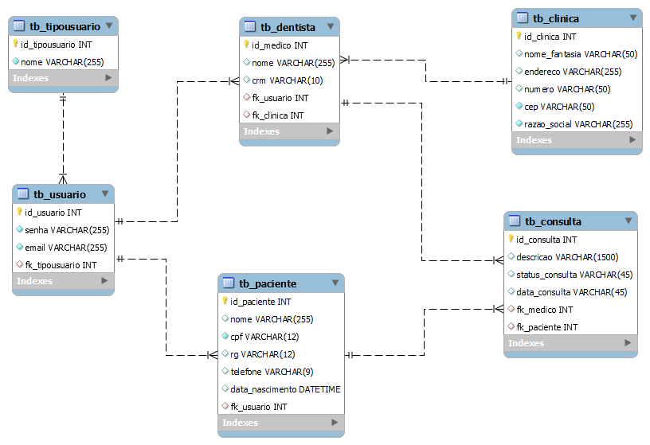
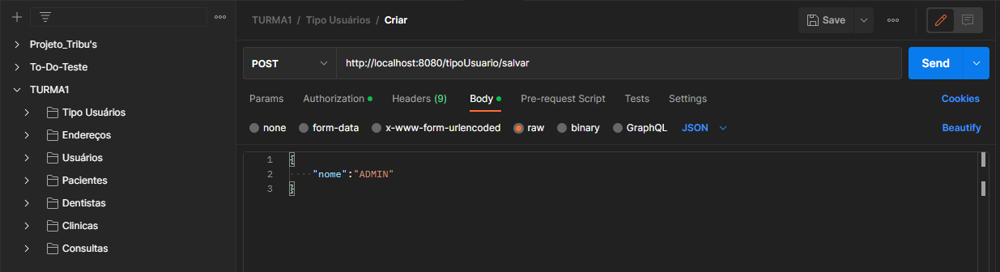

# Dentalclinic

Projeto de Consultas de uma Clínica Odontológica

## 🚀 Começando

Consulte **[Implantação](#-implantao)** para saber como implantar o projeto.
### 🎲 Diagrama UML



## 📦 Implantação

### [Postman](Postman/TURMA1.postman_collection.json)

## 🛠️ Construído com

* [Spring Boot](https://spring.io/) - O framework web usado
* [Maven](https://maven.apache.org/) - Gerente de Dependência
* [Postman](https://www.postman.com/) - Usada para teste de APIs
* [Intellij](https://www.jetbrains.com/idea/) - Usada para desenvolvimento
* [MySQL - Workbench](https://www.mysql.com/products/workbench/) - Usada para gerar banco de dados

## 🔗 Dependências
_Versão Java_
```java
<java.version>17</java.version>
```
```java
<dependency>
<groupId>org.springframework.boot</groupId>
<artifactId>spring-boot-starter-data-jpa</artifactId>
<version>2.7.3</version>
</dependency>
<dependency>
<groupId>org.springframework.boot</groupId>
<artifactId>spring-boot-starter-security</artifactId>
</dependency>
<dependency>
<groupId>org.springframework.boot</groupId>
<artifactId>spring-boot-starter-web</artifactId>
</dependency>

<dependency>
<groupId>org.springframework.boot</groupId>
<artifactId>spring-boot-devtools</artifactId>
<scope>runtime</scope>
<optional>true</optional>
</dependency>
<dependency>
<groupId>com.h2database</groupId>
<artifactId>h2</artifactId>
<scope>runtime</scope>
</dependency>
<dependency>
<groupId>org.hibernate</groupId>
<artifactId>hibernate-entitymanager</artifactId>
<version>5.6.11.Final</version>
</dependency>
<dependency>
<groupId>org.projectlombok</groupId>
<artifactId>lombok</artifactId>
<optional>true</optional>
</dependency>
<dependency>
<groupId>io.jsonwebtoken</groupId>
<artifactId>jjwt</artifactId>
<version>0.9.1</version>
</dependency>
<dependency>
<groupId>javax.xml.bind</groupId>
<artifactId>jaxb-api</artifactId>
<version>2.4.0-b180830.0359</version>
</dependency>
<dependency>
<groupId>junit</groupId>
<artifactId>junit</artifactId>
<scope>test</scope>
</dependency>
<dependency>
<groupId>org.springframework.boot</groupId>
<artifactId>spring-boot-starter-test</artifactId>
<scope>test</scope>
</dependency>
<dependency>
<groupId>org.springframework.security</groupId>
<artifactId>spring-security-test</artifactId>
<scope>test</scope>
</dependency>
```

## ✒️ Autores

* **Alexandre C. Pedro** - *Trabalho Inicial/Desenvolvimento/Teste/Implementação* - [Desenvolvedor](https://github.com/alexandrecpedro)
* **Fábio Neres** - *Trabalho Inicial/Desenvolvimento/Teste/Implementação* - [Desenvolvedor](https://github.com/neresfabio)
* **Tiago Vale** - *Trabalho Inicial/Desenvolvimento* - [Desenvolvedor](https://github.com/tpvale)
* **SanKler** - *Trabalho Inicial/Desenvolvimento* - [Desenvolvedor](https://github.com/linkParaPerfil)
* **Atef Chelaghma** - *Trabalho Inicial/Desenvolvimento* - [Desenvolvedor](https://github.com/linkParaPerfil)
* **Bruno Furukawa** - *Trabalho Inicial/Desenvolvimento/Teste/Implementação* - [Desenvolvedor](https://github.com/bfurukawa)

---
