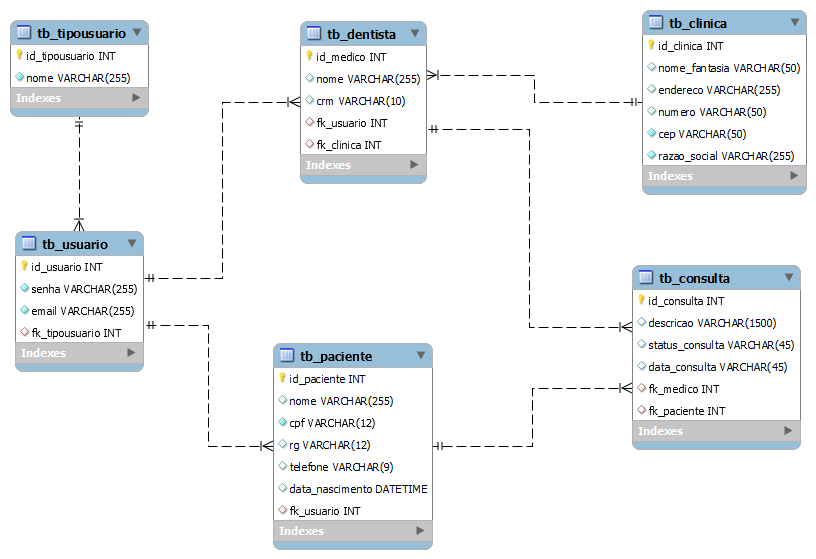

# Trabalho integrador: Sistema de Reserva de Consultas

Desejamos implementar um sistema que permita administrar a reserva/marcação de consultas para uma clínica odontológica. Os requisitos que devem ser
atendidos são os seguintes:

- Administração de dados odontológicos: Adicionar e modificar os dados dos dentistas. Registrar nome, sobrenome e matrícula de cadastro.
- Administração de pacientes: Registrar, modificar e excluir pacientes. De cada um se armazenam: nome, sobrenome, endereço, RG, data de alta.
- Login: Validar a entrada no sistema por meio de um login com nome de usuário e senha. Permitir que qualquer pessoa logada registre uma
consulta, mas apenas aqueles que têm uma função de administração pode gerenciar dentistas e pacientes.
- Registrar consulta: Deve ser possível permitir que um paciente seja atribuído a uma consulta com um dentista em uma determinada data e
hora.

## Requerimentos técnicos

A aplicação deve ser desenvolvida em camadas:

- Camada de entidade de negócios: são as classes Java do nosso negócio modeladas através do paradigma orientado a objetos.
- Camada de acesso a dados (Repositório): são as classes que se encarregam de acessar o banco de dados.
- Camada de dados (banco de dados): é o banco de dados do nosso sistema modelado através de um modelo entidade-relacionamento. Usaremos a
  base H2 por sua praticidade.
- Camada de negócio: são as classes de serviço que se encarregam de desacoplar o acesso aos dados da visão.
- Camada de apresentação: estas são as telas da web que teremos que desenvolver usando o framework Spring Boot MVC com os controladores e
  uma dessas duas opções: HTML+JavaScript ou React para a visualização.

> É importante tratar as exceções registrando qualquer exceção que possa ser
  gerada e realizando testes unitários para garantir a qualidade dos
  desenvolvimentos.

### Sprint 1

Uma vez iniciado o assunto com os conhecimentos já adquiridos em Programação
Orientada a Objetos, Banco de Dados I e Front End I, você pode começar a
construir seu modelo UML das classes que precisará para o projeto de integração,
bem como tudo relacionado às tabelas do banco de dados relacional que você
precisará para persistir os dados e as telas HTML com seus estilos para inseri-los.
Além disso, com o que você aprendeu durante essas semanas, você poderá
realizar os testes unitários das classes Java que você programou. Não se preocupe,
ao longo do curso você aprenderá a integrar todas essas partes.

#### DIAGRAMA UML

### Sprint 2

Durante este sprint, com tudo que foi aprendido no curso a partir da aula 18, você
poderá trabalhar com o Maven em seu projeto para referenciar suas bibliotecas e,
a partir da aula 24, poderá construir suas classes DAO (camada de acesso a dados
com JDBC ) e as classes de serviço (camada de negócios) para cada uma das
entidades em seu projeto. Dessa forma, você sempre poderá garantir o
funcionamento de tudo o que construir usando testes unitários.

### Sprint 3

Ao longo deste sprint, você estará refatorando a camada de acesso a dados para
poder acessar e recuperar dados por meio de um ORM. Criando os mapeamentos
e as classes de Repositório que serão substituídas pelos DAOs que cumprem a
mesma função.
Com tudo aprendido nas aulas 25, 27 e 28 você poderá construir as APIs durante
este sprint (através do desenvolvimento dos controladores) e a integração com a
camada de apresentação, ou seja, as telas HTML através de JavaScript.

### Sprint 4

O mais simples é deixado para o final. Após a aula 43, você pode facilmente
adicionar um login do Spring Security ao seu projeto.

## ✒️ Autores

* **Alexandre C. Pedro** - *Trabalho Inicial* - [Desenvolvedor](https://github.com/alexandrecpedro)
* **Fábio Neres** - *Trabalho Inicial* - [Desenvolvedor](https://github.com/neresfabio)
* **Tiago Vale** - *Trabalho Inicial* - [umdesenvolvedor]()
* **SanKler** - *Trabalho Inicial* - [umdesenvolvedor]()
* **Atef Chelaghma** - *Trabalho Inicial* - [umdesenvolvedor]()
* **Bruno Furukawa** - *Documentação* - [fulanodetal]()